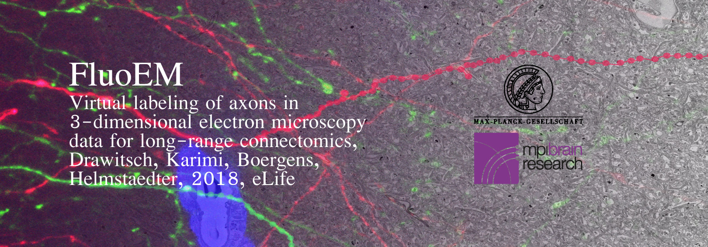

# About FluoEM

[FluoEM](http://fluoem.brain.mpg.de) is a set of experimental and computational methods allowing to directly match fluorescently labelled axons to their 3D EM counterparts without label conversion. The FluoEM paper is published in [eLife](https://elifesciences.org/articles/38976) (2018;7:e38976, doi:10.7554/eLife.38976). 

It allows to:

* Efficiently handle and register correlated 3D graph representations of neurites
* Identify potential neurite correspondences based on structural divergence 

It was developed at the Max Planck Institute of Neurobiology (2014) and the Max Planck Institute for Brain Research (2014 - 2018)

## Getting Started

If you have git installed, you can clone the FluoEM repository by entering
```
$ git clone https://gitlab.mpcdf.mpg.de/connectomics/FluoEM.git
```
into your terminal.

Alternatively, you can download the code as a compressed file via the gitlab frontend (click the small cloud icon).

### Prerequisites

The FluoEM code package is written in Matlab, so you will need Matlab license to run it. You do not need any additional Matlab toolboxes on top of that, the matlab core libraries are sufficient.

### Installing

After cloning or downloading the code, navigate into the FluoEM main directory inside Matlab and execute 
```
>> setup()
```
inside the Matlab command window to set the required paths. After this, you are ready to go. 

### First Steps

To reproduce methodological steps shown in the FluoEM paper or to familiarize yourself with the functionality of the FluoEM repository, have a look at the tutorials found in the `/tutorial` directory.

## Authors

The FluoEM package was developed by
* **Florian Drawitsch** 

under scientific supervision by
* **Moritz Helmstaedter**

Some of FluoEM's functionality is built around webKnossos (.nml) neurite skeleton files and makes use of an efficient .nml parser developed by 
* **Alessandro Motta**

The Matlab class used to represent single neurite skeletons was developed by
* **Benedikt Staffler**
* **Alessandro Motta**
* **Florian Drawitsch**
* **Ali Karimi**
* **Kevin Boergens**

## License

This project is licensed under the MIT License - see the [LICENSE.md](LICENSE.md) file for details

## Acknowledgements
We thank
* **Matt Jacobson** for providing the “Absolute Orientation – Horn’s method” Matlab central package we used in our affine registration workflow
and
* **Dirk-Jan Kroon** for providing the “B-spline Grid, image and point registration” Matlab central package we used for our free-form registration workflow
